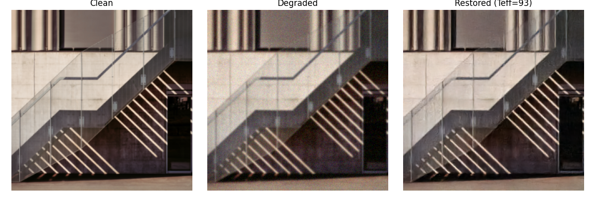
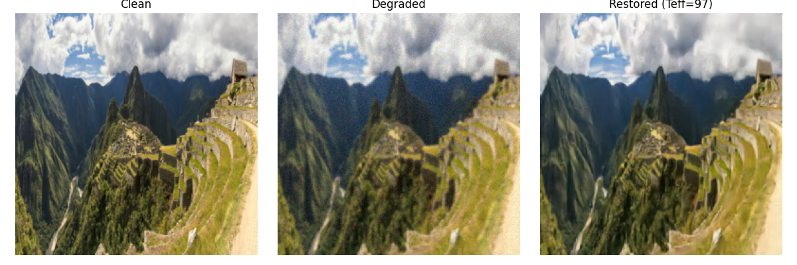

# Degradation-Aware Adaptive Diffusion for Old Photograph Restoration

### UCSD ECE-285 Course Project
A conditional diffusion model for old photo restoration that dynamically allocates DDIM sampling steps based on estimated degradation severity.




## Overview

The pipeline consists of four stages:

1. **Image Input** — load and preprocess a degraded image to `(1, 3, 256, 256)` float32 `[0, 1]`
2. **DACM** — estimate degradation type (noise / blur / fading) and a spatial severity map
3. **Scheduler** — map severity score `[0, 1]` → effective DDIM steps Teff `[20, 150]`
4. **DDIM Restoration** — run adaptive DDIM inference conditioned on the degraded image

## Project Structure

```
.
├── models/
│   ├── dacm.py               # Degradation-Aware Conditioning Module
│   ├── ddim_restoration.py   # DDIM inference loop
│   ├── diffusion.py          # Forward diffusion process (DDPM)
│   └── unet.py               # Conditional U-Net backbone
├── datasets/
│   └── restoration_dataset.py  # Dataset with online random degradation
├── utils/
│   ├── degradations.py       # Gaussian noise / blur / fading augmentations
│   ├── preprocessing.py      # Image loading → tensor
│   └── scheduler.py          # severity_to_teff mapping
├── train.py                  # Train the diffusion U-Net
├── train_dacm.py             # Train the DACM module
├── sample_ddim.py            # Full inference: DACM + DDIM restoration
├── test_dacm.py              # Standalone DACM inference on a single image
│
└── requirements.txt
```

## Environment Setup
 
**Python 3.9 + CUDA 11.8** (tested on PyTorch 2.5.1)
 
```bash
# 1. Create conda environment
conda create -n ENV python=3.9
conda activate ENV
 
# 2. Install PyTorch with CUDA 11.8
conda install pytorch==2.5.1 torchvision==0.20.1 pytorch-cuda=11.8 -c pytorch -c nvidia
 
# 3. Install remaining dependencies
pip install -r requirements.txt
```

## Data Preparation

Place download training images (`.jpg`, `.jpeg`, `.png`, `.bmp`, `.webp`) in a flat folder via online resources like:

[DIV2K](http://data.vision.ee.ethz.ch/cvl/DIV2K/DIV2K_train_HR.zip), and place them into `data/train`
```
data/
└── train/
    ├── 0001.png
    ├── 0002.png
    └── ...
```

Degraded images are generated during training — no preprocessing needed.

## Training
 
### 1. Train Diffusion U-Net
 
```bash
python train.py
```
 
Key settings are configured inside the script (no CLI arguments):
 
| Setting | Default | Description |
|---|---|---|
| `image_dir` | `data/train` | Path to clean training images |
| `image_size` | `256` | Image resolution |
| `batch_size` | `4` | Batch size |
| `lr` | `1e-4` | Learning rate |
| `timesteps` | `200` | Diffusion timesteps |
| `target_steps` | `175680` | Total training steps (~120 epochs) |
 
Training supports auto-resume from `checkpoints/train_state_last.pth`. Final model is saved to `checkpoints/model_last.pth`.

### 2. Train DACM
 
```bash
python train_dacm.py --image_dir data/train --epochs 30 --batch_size 16 --lr 1e-3 --log_dir logs/dacm --ckpt_dir checkpoints
```
 
Key arguments:
 
| Argument | Default | Description |
|---|---|---|
| `--image_dir` | `data/train` | Path to clean training images |
| `--epochs` | `30` | Number of training epochs |
| `--batch_size` | `16` | Batch size |
| `--lr` | `1e-3` | Learning rate |
| `--lambda_s` | `1.0` | Severity loss weight |
| `--save_every` | `5` | Save checkpoint every N epochs |
 
Loss history is saved to `logs/dacm/loss.csv`. Checkpoints are saved to `checkpoints/dacm_epoch{N}.pth` and `checkpoints/dacm_last.pth`.
 
## Inference
 
### Full restoration pipeline (DACM + DDIM)
 
```bash
python sample_ddim.py --image_dir data/train --ckpt checkpoints/model_last.pth --dacm_ckpt checkpoints/dacm_last.pth --sample_index 0 --save_path result.png
```

Key arguments:
 
| Argument | Default | Description |
|---|---|---|
| `--ckpt` | `checkpoints/model_last.pth` | Diffusion U-Net checkpoint |
| `--dacm_ckpt` | `checkpoints/dacm_last.pth` | DACM checkpoint |
| `--teff` | `None` | Override Teff directly (skip DACM) |
| `--severity` | `None` | Override severity score manually |
| `--init_mode` | `img2img` | `img2img` or `pure_noise` |
| `--strength` | `0.35` | Noise strength for img2img init |
| `--timesteps` | `200` | Total diffusion timesteps |

Teff resolution priority: `--teff` > `--severity` > DACM auto-estimate > fallback (80 steps).
When using DACM auto-estimate, the severity score is adjusted based on detected degradation types.

### Standalone DACM test
 
```bash
python test_dacm.py --image path/to/photo.png --ckpt checkpoints/dacm_last.pth --heuristic
```
 
Output includes degradation type probabilities, severity score, Teff, and severity map statistics. `--heuristic` additionally runs the Laplacian-variance fallback estimator.
 
## Degradation Types
 
Training applies random combinations of three synthetic degradations:
 
| Type | Severity |
|---|---|
| Gaussian noise | (σ − σ_min) / (σ_max − σ_min) |
| Gaussian blur | (r − r_min) / (r_max − r_min) |
| Fading | 1 − normalized value (inverted) |
 
Sampling strategy: 50% single degradation, 30% two degradations, 20% all three.